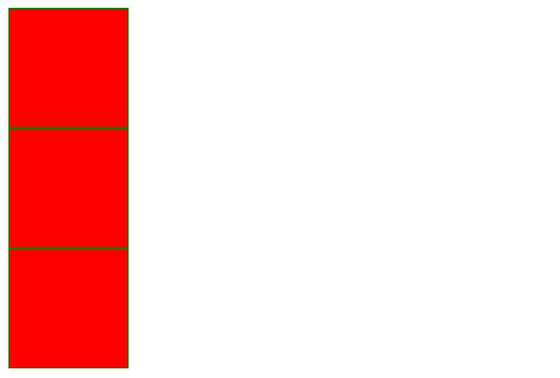
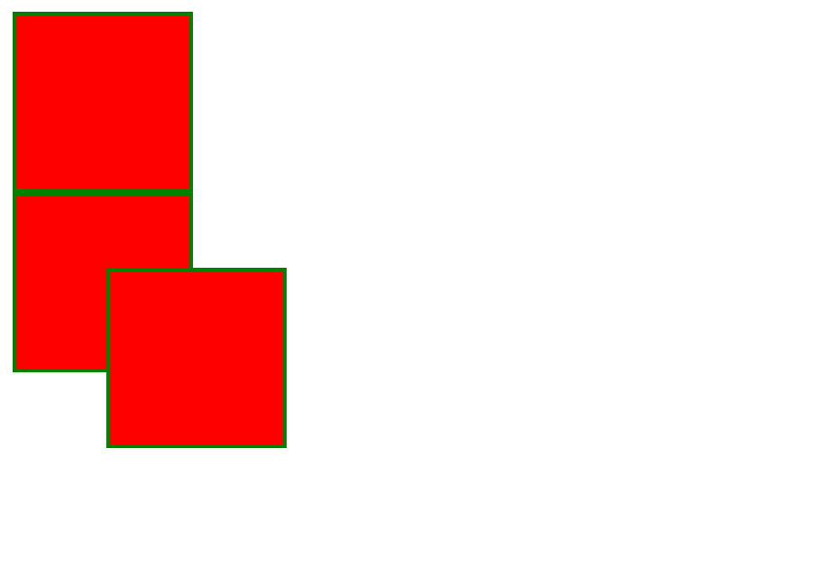
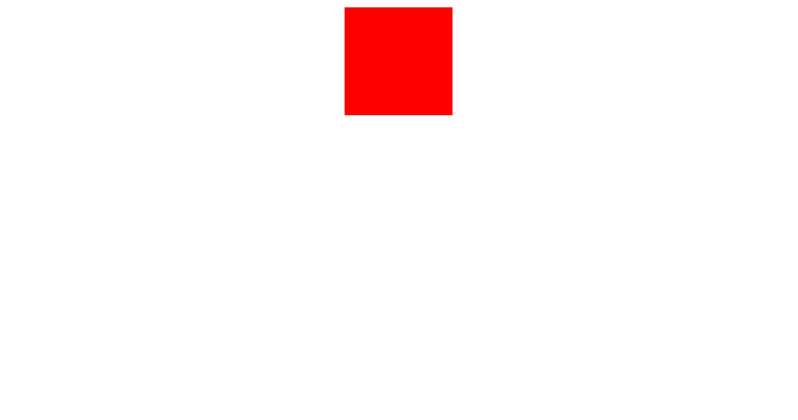
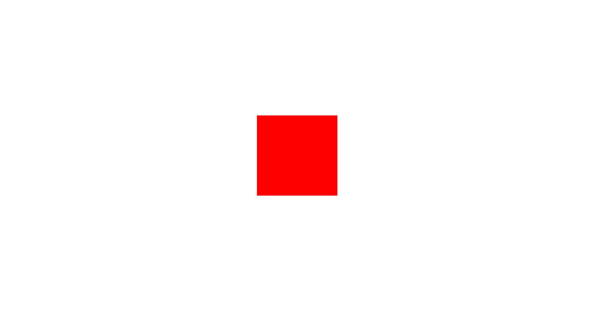
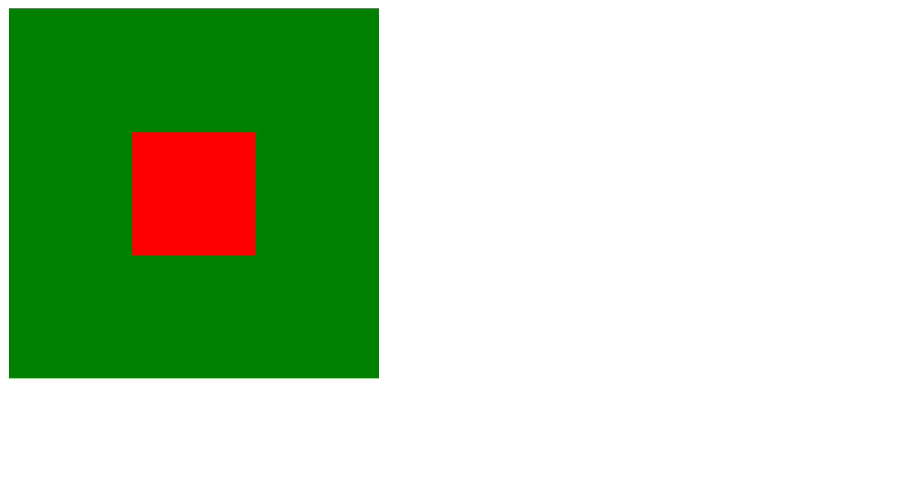

# Posicionament de capes en HTML

La propietat `position` serveix per posicionar un element dins de la pàgina. No obstant això, depenent de quina sigui la propietat que usem, l'element prendrà una referència o una altra per posicionar-se respecte a ella.

Els possibles valors que pot adoptar la propietat `position` són: `static | relative | absolute | fixed | inherit | initial`.

## position: static

És el valor que pren un element per defecte per posicionar-se. Amb aquest valor, l'element respectarà el flux normal de la pàgina, és a dir, es posicionarà en el lloc que li correspon i no tindrà en compte els valors per les propietats top, left, right i bottom.

```css
.vermell {
  height: 100px;
  width: 100px;
  background-color: red;
  border: thin solid green;
}

#mogut {
  left: 100px;
}
```
```html
<div class="vermell"> </div>
<div id="mogut" class="vermell"> </div>
<div class="vermell"> </div>
```



Fixa't que he posat un `id` a el segon `div` i l'he anomenat mogut. Li estic intentant aplicar la propietat `left` sense resultats.

## position: relative

Mitjançant aquest valor podem posicionar un element respecte a el flux normal de la pàgina. Es podria dir que estem posicionant un element prenent com a referència el flux normal (la posició per defecte) d'aquest element.

Podrem utilitzar `top | left | right | bottom` per posicionar el nostre element prenent com a referència la posició per defecte de l'element. En aquest cas, vaig a aplicar-li la propietat `left`: 100px de l'exemple anterior i el `div` mogut es desplaçarà 100 píxels a la dreta des de la seva posició per defecte.

```css
.vermell {
  height: 100px;
  width: 100px;
  background-color: red;
  border: 2px green solid;
}

#mogut {
  position: relative;
  left: 100px;
}
```
```html
<div class="vermell"> </div>
<div id="mogut" class="vermell"> </div>
<div class="vermell"> </div>
```


## position: absolute

Aquest valor també acceptarà els valors `top, left, right i bottom`. L'element amb `position: absolute` no estarà dins el flux normal de la pàgina i prendrà com a referència la finestra de el navegador o l'element posicionat (que tingui qualsevol valor de `position` excepte `static`) més proper si és pare de l'element que volem posicionar.
A continuació et mostro un exemple de cadascun:

### Exemple prenent com a referència la finestra del navegador

En aquest cas vaig a prendre com a referència la finestra de el navegador i desplaçar el `div` `mogut` 40 píxels cap avall i 50 píxels a la dreta respecte a aquesta.

Pots observar que el `div` `mogut`, al no estar dins de l'flux normal de la pàgina, no afecta el flux normal de la resta d'elements i per tant els altres dos elements es posicionen junts (sense respectar l'espai que deixa el `div` `mogut` en el exemple anterior, en el qual sí que està en el flux normal de la pàgina).

```css
.vermell {
  height: 100px;
  width: 100px;
  background-color: red;
  border: 2px green solid;
}

#mogut {
  position: absolute;
  top: 40px;
  left: 50px;
}
```
```html
<div class="vermell"> </div>
<div id="mogut" class="vermell"> </div>
<div class="vermell"> </div>
```


### Exemple prenent com a referència l'element pare amb position: relative més proper

En aquest cas, he utilitzat el mateix CSS per al `div` amb `id="mogut"` que en l'exemple anterior perquè es veiés que en aquest cas el `div` mogut pren com a referència l'element pare amb `position: relative` i no la finestra de el navegador (40 píxels cap avall i 50 píxels cap a la dreta respecte de l'element pare).

```css
.vermell {
  height: 100px;
  width: 100px;
  background-color: red;
  border: 2px green solid;
}

#relatiu {
  position: relative;
}

#mogut {
  position: absolute;
  top: 40px;
  left: 50px;
}
```
```html
<div class="vermell"> </div>
<div id="relatiu" class="vermell">
  <div id="mogut" class="vermell"> </div>
</div>
```



## position: fixed

Els elements als quals se'ls posiciona amb `position: fixed` també estan fora de l'flux normal de la pàgina. No obstant això, no es deu confondre amb els elements que estan posicionats amb `position: absolute`.

A diferència d'aquests últims, els elements amb `position: fixed` prenen com a referència la finestra de el navegador i no respecten el tenir un contenidor pare que estigui posicionat. A més, al fer scroll a la pàgina, l'element que estigui posicionat com `position: fixed` seguirà en la mateixa posició respecte a la finestra de el navegador encara que el scroll hagi desplaçat la pàgina cap avall.

Com una imatge val més que mil paraules i prenent com a referència l'últim exemple de l'apartat `position: absolute`:

```css
.vermell {
  height: 100px;
  width: 100px;
  background-color: red;
  border: 2px green solid;
}

#primer {
  height: 2000px
}

#relatiu {
  position: relative;
}

#mogut {
  position: fixed;
  top: 40px;
  left: 50px;
}
```
```html
<div id="primer" class="vermell"> </div>
<div id="relatiu" class="vermell">
  <div id="mogut" class="vermell"> </div>
</div>
```


Com pots observar, el `div` `mogut` està posicionat amb `position: fixed` respecte a la finestra de el navegador independentment que estigui contingut en un element amb `position: relative` o que es realitzi un `scroll` sobre la pàgina.

## position: inherit

Realment la propietat `position` amb el valor `inherit` actua de la mateixa manera que la resta de propietats que poden obtenir aquest valor, hereta el valor per a aquesta propietat de l'element pare.

## position: initial

Igual que amb el valor anterior, actua de la mateixa manera que la resta de propietats que poden obtenir aquest valor, en aquest cas fent que la propietat `position` prengui el seu valor per defecte, de manera que, usant `position: initial`, seria el mateix que indicar `position: static`.

## position: sticky

Aquest és un valor que és nou relativament per a aquesta propietat.

Usant aquest valor, l'element actua com si estigués posicionat amb el valor `relative` fins que s'arriba a un llindar de desplaçament (en el propi element o en l'element pare), amb el qual l'element passa a posicionar-se com si estigués posicionat amb el valor `fixed`.

Per exemple, anem a prendre com a referència un menú horitzontal que està a la part superior de la pàgina sota el logotip de l'empresa a la qual pertanyem.

Una cosa així:

```console
+ ---------------------------------------------- +
| LOGO                                           |
|                                                |
+ ---------------------------------------------- +
| MENÚ RELATIU                                   |
+ ---------------------------------------------- +
|                                                |
|                                                |
| CONTINGUT                                      |
|                                                |
|                                                |
|                                                |
+ ---------------------------------------------- +
```

I volem que quan al fer `scroll` i el menú ja no càpiga a la pantalla (és a dir, el valor de la propietat top sigui menor que 0), el menú quedi fix a la part superior de la pantalla.

Una cosa així:
```console
+ ---------------------------------------------- +
| MENÚ FIX                                       |
+ ---------------------------------------------- +
|                                                |
|                                                |
| CONTINGUT                                      |
|                                                |
|                                                |
|                                                |
+ ---------------------------------------------- +
```

Per a això emprarem el valor `sticky` ja que ens farà la feina sense necessitat d'usar `Javascript`.

L'ús seria així:

Indiquem el llindar de desplaçament amb el qual l'element passarà de comportar
com `position: relative` a `position: fixed`, és a dir, quan l'element prengui el valor de `top: 0` pel que fa a la pantalla del navegador, aquest canviarà el seu comportament.

```css
#menu {
   position: sticky; / * Posicionem l'element amb el valor sticky * /
   top: 0;
}
```

En aquest exemple podeu fer scroll cap amunt i cap avall per veure que el `div` `menu` es queda fix quan arriba `top: 0`.

```css
#marca {
  height: 50px;
  width: 100%;
  background-color: green;
  text-align: center;
}

#marca img {
  height: 100%;
}

#menu {
   position: sticky;
   top: 0;
   height: 100px;
   width: 100%;
   background-color: red;
}

#contenido {
   height: 1200px;
   width: 100%;
   background-color: yellow;
}
```

```html
<div id="marca">
  
</div>

<div id="menu"> </div>
<div id="contingut"> CONTINGUT </div>
```

No obstant això -i és el motiu principal pel qual no ho he indicat a l'inici de la resposta com a valor de la propietat `position`- encara no està totalment suportat per tots els navegadors.

Pots veure els navegadors compatibles amb aquesta propietat aquí.


# Exemples típics.

Aquests són alguns exemples típics sobre posicionament (centrat).

1. Centrar div horitzontalment a la pàgina (amb `position: relative`)

```css
#centrat {
  position: relative;
  margin: 0 auto;
  height: 100px;
  width: 100px;
  background-color: red;
}
```

```html
<div id="centrat"> </div>
```


2. Centrar div horitzontalment a la pàgina (amb `position: absolute`)

```css
#centrat {
  position: absolute;
  left: 0;
  right: 0;
  margin: 0 auto;
  height: 100px;
  width: 100px;
  background-color: red;
}
```
```html
<div id="centrat"> </div>
```


3. Centrar div horitzontalment a la pàgina (amb `position: static` , valor per defecte)


```css
#centrat {
  margin: 0 auto;
  height: 100px;
  width: 100px;
  background-color: red;
}
```

```html
<div id="centrat"> </div>
```




4. Centrar div horitzontalment dins d'un altre div

```css
#contenidor {
  position: relative;
  height: 300px;
  width: 300px;
  background-color: green;
}

#centrat {
  position: absolute;
  left: 0;
  right: 0;
  margin: 0 auto;
  height: 100px;
  width: 100px;
  background-color: red;
}
```

```html
<div id = "contenidor">
    <div id = "centrat"> </div>
</div>
```


5. Centrar div horitzontalment i verticalment a la pàgina

```css
#centrat {
  position: absolute;
  top: 0;
  left: 0;
  right: 0;
  bottom: 0;
  margin: auto;
  height: 100px;
  width: 100px;
  background-color: red;
}
```

```html
<div id="centrat"> </div>
```




6. Centrar div verticalment i horitzontalment dins un altre div

```css
#contenidor {
  position: relative;
  height: 300px;
  background-color: green;
  width: 300px;
}

#centrat {
  position: absolute;
  top: 0;
  left: 0;
  right: 0;
  bottom: 0;
  margin: auto;
  height: 100px;
  width: 100px;
  background-color: red;
}
```

```html
<div id="contenidor">
   <div id="centrat"> </div>
</div>
```

